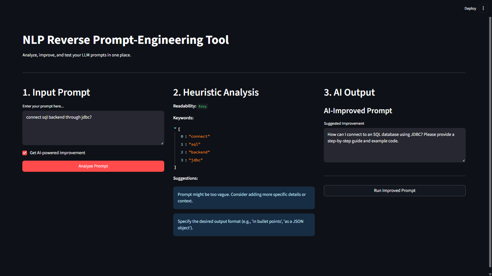

# NLP Reverse Prompt-Engineering Tool

A full-stack web application (Streamlit + Flask) that uses a **custom-trained machine learning model** to intelligently analyze, improve, and test LLM prompts.

---

## Demo

This workbench provides a clean, 3-column interface for a complete prompt engineering workflow.



---

## 💡 Core Concept: Why an ML Model?

Most prompt analysis tools use simple, rigid rules (e.g., `if len(prompt) < 10`). This is fragile and not very "smart."

This project's core innovation is treating prompt quality as a **machine learning problem**. A custom classifier is trained on a labeled dataset to detect nuanced issues like vagueness or missing actions. This makes the "Analysis" (Column 2) far more intelligent and reliable than simple heuristics.

---

## Workflow & Features

### Column 1: Input Prompt
* **Prompt Area:** A simple text box to write or paste your initial prompt.
* **AI Improvement:** A checkbox to decide if you want the OpenAI API to rewrite and improve your prompt.
* **Analyze Button:** Sends the prompt to the backend for analysis.

### Column 2: ML-Powered Heuristic Analysis
The user's prompt is sent to the Flask API, which uses the `prompt_classifier.pkl` model to provide "smart" suggestions.
* **Custom ML Suggestions:** The model predicts if the prompt is:
    * `is_vague`: Lacks specific details or context.
    * `no_action_verb`: Doesn't have a clear task (e.g., "Summarize", "Explain").
    * `no_format`: Doesn't specify a desired output format (e.g., "in bullet points").
* **Keywords:** Uses `spaCy` to extract the most relevant keywords from the prompt.
* **Readability:** A placeholder score for topic complexity.

### Column 3: AI Improvement & Final Output
* **AI-Improved Prompt:** If the checkbox was ticked, the user's prompt is sent to the OpenAI API (`gpt-4o-mini`) with a meta-prompt, asking it to be rewritten for clarity and effectiveness.
* **Run Improved Prompt:** A button appears, allowing the user to take this new, improved prompt and run it against the OpenAI API.
* **Generated Response:** The final output from the LLM is displayed, completing the feedback loop.

---

##📂 Project Structure


Reverse-Prompt-Engineering/
│
├── .env
├── .gitignore
├── requirements.txt
├── README.md
├── Model_Training.ipynb
│
├── backend/
│ ├── init.py
│ ├── app.py
│ ├── prompt_analyzer.py
│ └── prompt_classifier.pkl
│
└── frontend/
└── app.py


## 🤖 The Machine Learning Model

The core of this project is the `prompt_classifier.pkl` file.

Model Type: A `scikit-learn` Pipeline.
Pipeline Steps:
    1.  `TfidfVectorizer`: Converts the raw prompt text into a numerical matrix.
    2.  `MultiOutputClassifier`: Wraps a `LogisticRegression` classifier, allowing the model to predict multiple labels (problems) for a single prompt.
  Training Data: The model was trained on the `NLP_Prompt.csv` dataset, which contains various prompts hand-labeled with the `is_vague`, `no_action_verb`, and `no_format` tags.
 Performance: The dataset was imbalanced (e.g., many prompts were missing a format, but fewer were missing an action verb). To fix this, the `LogisticRegression` model was trained with `class_weight='balanced'`. This resulted in a high-performance model with an F1-score of ~0.90 (90%) across all labels.

---

##  ⚙️ Tech Stack

* Frontend: Streamlit
* Backend: Flask, Flask-CORS
* Machine Learning: Scikit-learn, Pandas, Joblib
* Core NLP: spaCy
* LLM API: OpenAI
* Deployment (Local): `flask run` & `streamlit run`

---

## 🚀 How to Run Locally

### 1. Prerequisites
* Python 3.9+
* An [OpenAI API Key](https://platform.openai.com/api-keys)

### 2. Setup

1.  **Clone the repository:**
    ```bash
    git clone [https://github.com/your-username/Reverse-Prompt-Engineering.git](https://github.com/your-username/Reverse-Prompt-Engineering.git)
    cd Reverse-Prompt Engineering
    ```

2.  **Create a virtual environment and install requirements:**
    ```bash
    # Create venv
    python -m venv venv
    
    # Activate venv
    # Windows
    .\venv\Scripts\activate
    # macOS/Linux
    source venv/bin/activate
    
    # Install all packages
    pip install -r requirements.txt
    
    # Download the spaCy model
    python -m spacy download en_core_web_sm
    ```

3.  **Create your Environment File:**
    Create a file named `.env` in the root folder (`Reverse-Prompt-Engineering/`) and add your API key:
    ```
    OPENAI_API_KEY="sk-..."
    ```

### 3. Run the Application

You need to run two terminals.

 **Terminal 1: Run the Flask Backend**
    ```bash
    # From the root project folder
    flask --app backend/app.py run
    ```
    *(The backend will run on `http://127.0.0.1:5000`)*

 **Terminal 2: Run the Streamlit Frontend**
    ```bash
    # From the root project folder
    streamlit run frontend/app.py
    ```
    *(Streamlit will automatically open `http://localhost:8501` in your browser)

---

## ✉️ Contact

This project was built by Kshitij Gokhale.

For any questions, feedback, or inquiries, please feel free to reach out:
Email: `kshitijgokhale134@gmail.com`
LinkedIn: `https://www.linkedin.com/in/kshitij-gokhale-5132b928a?lipi=urn%3Ali%3Apage%3Ad_flagship3_profile_view_base_contact_details%3Bn7YHafHyQOiht%2BFEv1%2BNkA%3D%3D`